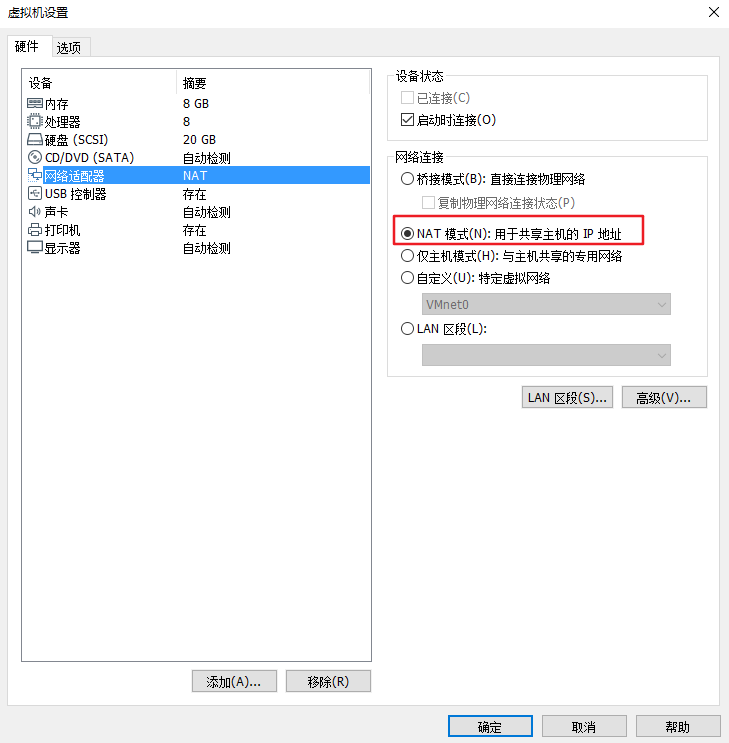
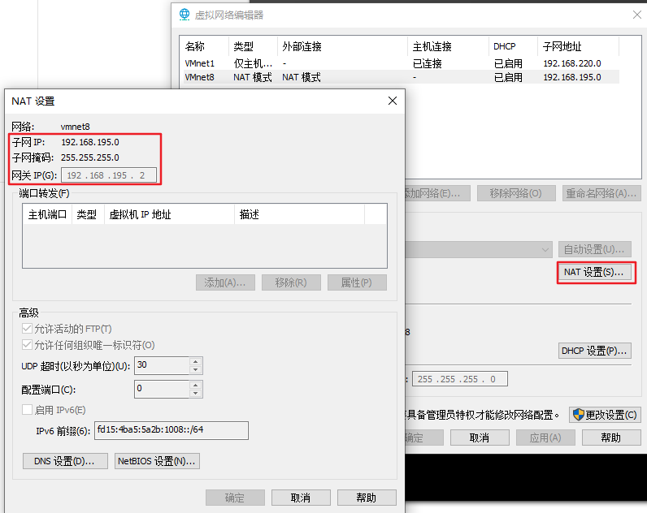
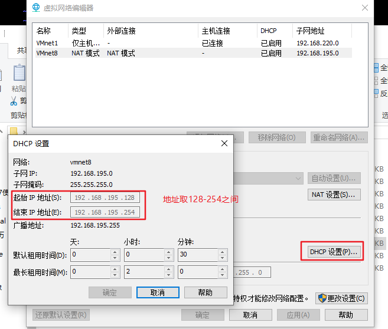
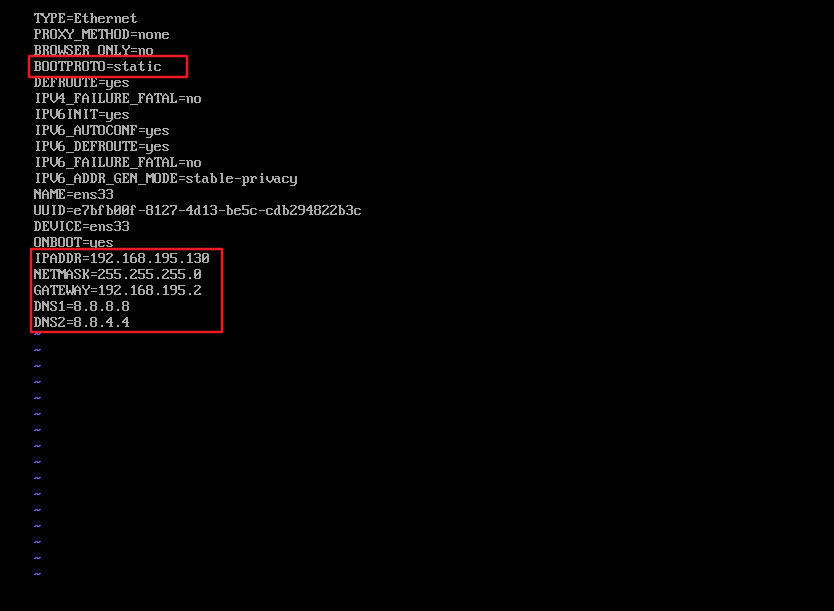
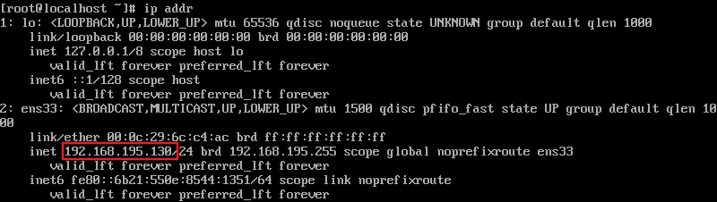
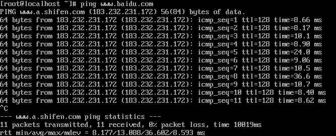

### VMware上安装的centos7使用ping报错：name or service not known
#### 一、需要把虚拟机的网络连接设置为“NAT模式”


#### 二、获取网络信息



#### 三、编辑IP，子网掩码，网关等信息
```
vi /etc/sysconfig/network-scripts/ifcfg-ens33
```



#### 四、查看ip
```
ip addr
```



#### 五、重启网络
```
service network restart
```

#### 六、最后测试网络连接
```
ping www.baidu.com
```


